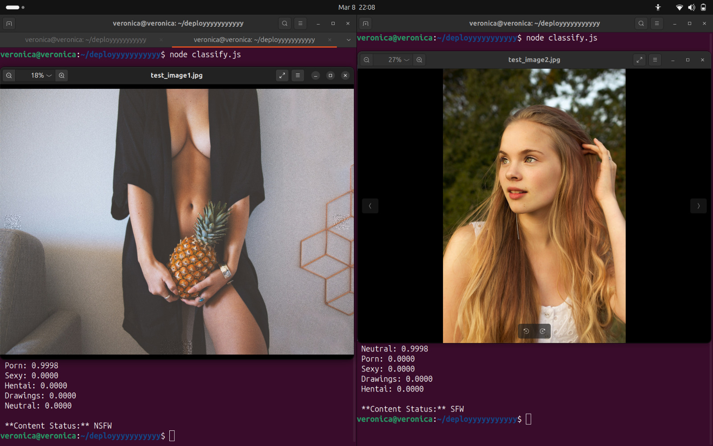

# NSFW Detection API & Client


## Overview
NSFW detection system that can classify images and text as NSFW (Not Safe For Work) or SFW (Safe For Work). It includes an API for image and text classification and client implementations in JavaScript and Python.

## Screenshot



## Features
- Detect NSFW content in images and text.
- API for hosting NSFW detection services.
- Clients available in JavaScript and Python.

## Repository Contents
- `Nsfw_detection_api_host.py`: Python-based API server for NSFW detection.
- `Nsfw_detection_client.py`: Python client for interacting with the NSFW detection API.
- `Nsfw_detection_client.js`: JavaScript client for interacting with the NSFW detection API.

## Installation & Setup
### Prerequisites
- Python 3.x
- Node.js (for JavaScript client)
- Required Python libraries (listed in `requirements.txt` if available)

### Setup (API Server)
1. Install dependencies:
   ```sh
   pip install -r requirements.txt
   ```
2. Run the API server:
   ```sh
   python Nsfw_detection_api_host.py
   ```

### Setup (Python Client)
1. Install dependencies:
   ```sh
   pip install requests
   ```
2. Run the client:
   ```sh
   python Nsfw_detection_client.py
   ```

### Setup (JavaScript Client)
1. Install dependencies:
   ```sh
   npm install axios
   ```
2. Run the client:
   ```sh
   node Nsfw_detection_client.js
   ```

## Usage
### API Endpoints
- `POST /detect_image` - Uploads an image for NSFW detection.
- `POST /detect_text` - Sends text for NSFW classification.

### Example Request (Python Client)
```python
import requests

url = "http://localhost:5000/detect_image"
files = {"file": open("image.jpg", "rb")}
response = requests.post(url, files=files)
print(response.json())
```

### Example Request (JavaScript Client)
```javascript
const axios = require("axios");
const fs = require("fs");

const formData = new FormData();
formData.append("file", fs.createReadStream("image.jpg"));

axios.post("http://localhost:5000/detect_image", formData, {
  headers: formData.getHeaders(),
})
.then(response => console.log(response.data))
.catch(error => console.error(error));
```

## Contributing
Contributions are welcome! Feel free to open an issue or submit a pull request.

